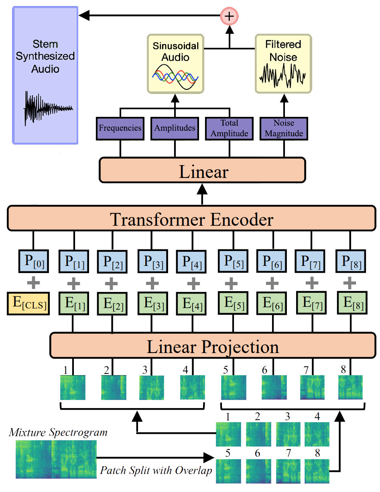

# AST-DDSP: Audio Source Separation with DDSP

This repository contains the code for the project of Deep Learning & Applied AI course at the University of La Sapienza, Rome.

## Abstract

When listening to music, we listen to a mixture of different instruments and vocals.
Music Source Separation is the task of separating the different sources which compose a music track.
In this work a novel approach for MSS is proposed, based on the **Audio Spectrogram Transformer** performing regression over the parameters of the **Differentiable Digital Signal Processing** in order to reconstruct the stem track of an instrument from the mixture.

    

Read the [report](https://github.com/davegabe/ast-ddsp-mss/blob/main/report.pdf) for more details.

## Results

Here we have some example from the testing set of the model trained on the Slakh2100 dataset.

### Bass

<table>
    <tr>
        <th>Track</th>
        <th>Mixture</th>
        <th>Bass</th>
        <th>Bass (AST-DDSP)</th>
    </tr>
    <tr>
        <td>1</td>
        <td>
            <audio controls>
                <source src="audio/1/mix.wav" type="audio/wav">
                <a href="audio/1/mix.wav">Download</a>
                or <a href="https://davegabe.github.io/ast-ddsp-mss">GitHub Pages</a>
            </audio>
        </td>
        <td>
            <audio controls>
                <source src="audio/1/bass.wav" type="audio/wav">
                <a href="audio/1/bass.wav">Download</a>
                or <a href="https://davegabe.github.io/ast-ddsp-mss">GitHub Pages</a>
            </audio>
        </td>
        <td>
            <audio controls>
                <source src="audio/1/gen_bass.wav" type="audio/wav">
                <a href="audio/1/gen_bass.wav">Download</a>
                or <a href="https://davegabe.github.io/ast-ddsp-mss">GitHub Pages</a>
            </audio>
        </td>
    </tr>
    <tr>
        <td>2</td>
        <td>
            <audio controls>
                <source src="audio/2/mix.wav" type="audio/wav">
                <a href="audio/2/mix.wav">Download</a>
                or <a href="https://davegabe.github.io/ast-ddsp-mss">GitHub Pages</a>
            </audio>
        </td>
        <td>
            <audio controls>
                <source src="audio/2/bass.wav" type="audio/wav">
                <a href="audio/2/bass.wav">Download</a>
                or <a href="https://davegabe.github.io/ast-ddsp-mss">GitHub Pages</a>
            </audio>
        </td>
        <td>
            <audio controls>
                <source src="audio/2/gen_bass.wav" type="audio/wav">
                <a href="audio/2/gen_bass.wav">Download</a>
                or <a href="https://davegabe.github.io/ast-ddsp-mss">GitHub Pages</a>
            </audio>
        </td>
    </tr>
    <tr>
        <td>3</td>
        <td>
            <audio controls>
                <source src="audio/3/mix.wav" type="audio/wav">
                <a href="audio/3/mix.wav">Download</a>
                or <a href="https://davegabe.github.io/ast-ddsp-mss">GitHub Pages</a>
            </audio>
        </td>
        <td>
            <audio controls>
                <source src="audio/3/bass.wav" type="audio/wav">
                <a href="audio/3/bass.wav">Download</a>
                or <a href="https://davegabe.github.io/ast-ddsp-mss">GitHub Pages</a>
            </audio>
        </td>
        <td>
            <audio controls>
                <source src="audio/3/gen_bass.wav" type="audio/wav">
                <a href="audio/3/gen_bass.wav">Download</a>
                or <a href="https://davegabe.github.io/ast-ddsp-mss">GitHub Pages</a>
            </audio>
        </td>
    </tr>
</table>

### Drum

<table>
    <tr>
        <th>Track</th>
        <th>Mixture</th>
        <th>Drum</th>
        <th>Drum (AST-DDSP)</th>
    </tr>
    <tr>
        <td>1</td>
        <td>
            <audio controls>
                <source src="audio/1/mix.wav" type="audio/wav">
                <a href="audio/1/mix.wav">Download</a>
                or <a href="https://davegabe.github.io/ast-ddsp-mss">GitHub Pages</a>
            </audio>
        </td>
        <td>
            <audio controls>
                <source src="audio/1/drum.wav" type="audio/wav">
                <a href="audio/1/drum.wav">Download</a>
                or <a href="https://davegabe.github.io/ast-ddsp-mss">GitHub Pages</a>
            </audio>
        </td>
        <td>
            <audio controls>
                <source src="audio/1/gen_drum.wav" type="audio/wav">
                <a href="audio/1/gen_drum.wav">Download</a>
                or <a href="https://davegabe.github.io/ast-ddsp-mss">GitHub Pages</a>
            </audio>
        </td>
    </tr>
    <tr>
        <td>2</td>
        <td>
            <audio controls>
                <source src="audio/2/mix.wav" type="audio/wav">
                <a href="audio/2/mix.wav">Download</a>
                or <a href="https://davegabe.github.io/ast-ddsp-mss">GitHub Pages</a>
            </audio>
        </td>
        <td>
            <audio controls>
                <source src="audio/2/drum.wav" type="audio/wav">
                <a href="audio/2/drum.wav">Download</a>
                or <a href="https://davegabe.github.io/ast-ddsp-mss">GitHub Pages</a>
            </audio>
        </td>
        <td>
            <audio controls>
                <source src="audio/2/gen_drum.wav" type="audio/wav">
                <a href="audio/2/gen_drum.wav">Download</a>
                or <a href="https://davegabe.github.io/ast-ddsp-mss">GitHub Pages</a>
            </audio>
        </td>
    </tr>
    <tr>
        <td>3</td>
        <td>
            <audio controls>
                <source src="audio/3/mix.wav" type="audio/wav">
                <a href="audio/3/mix.wav">Download</a>
                or <a href="https://davegabe.github.io/ast-ddsp-mss">GitHub Pages</a>
            </audio>
        </td>
        <td>
            <audio controls>
                <source src="audio/3/drum.wav" type="audio/wav">
                <a href="audio/3/drum.wav">Download</a>
                or <a href="https://davegabe.github.io/ast-ddsp-mss">GitHub Pages</a>
            </audio>
        </td>
        <td>
            <audio controls>
                <source src="audio/3/gen_drum.wav" type="audio/wav">
                <a href="audio/3/gen_drum.wav">Download</a>
                or <a href="https://davegabe.github.io/ast-ddsp-mss">GitHub Pages</a>
            </audio>
        </td>
    </tr>
</table>

## Acknowledgements

-   [DDSP](https://github.com/acids-ircam/ddsp_pytorch)
-   [AST](https://github.com/YuanGongND/ast)
-   [Slakh2100](http://www.slakh.com/)
-   [Auraloss](https://github.com/csteinmetz1/auraloss)
